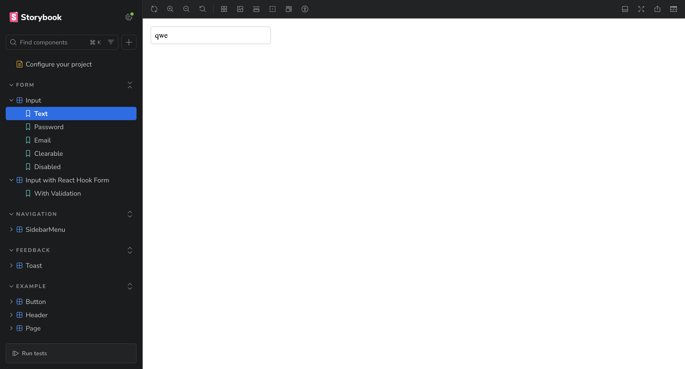
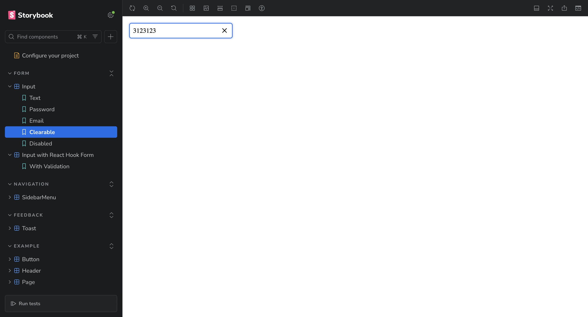

## Installation

```bash
npm install
npm run storybook
```

Storybook will open at `http://localhost:6006`

## Components

### Input

- Support for different types (text, password, email, number, date)
- Toggle password visibility 
- Clear button 
- Smooth animations on focus






###  Toast

- Three notification types: success (green), error (red), info (gray)
- Auto-dismiss feature
- Smooth slide-in animation


### Sidebar Menu

- Slides in from the right with animation
- Support for nested menu items
- Close button inside the menu


### React Hook Form

- Complete form example with validation
- Username, email, and password validation


##  Features

 TypeScript  
 CSS Modules with animations  
 Storybook with live prop editing (`@storybook/addon-controls`)  
 React Hook Form for validation  
 UI with gradients and transitions

## Tech Stack

- React 18 + TypeScript
- Vite
- Storybook
- CSS Modules
- React Hook Form

## Project Structure

```
src/components/
├── Input/
│   ├── Input.tsx
│   ├── Input.module.css
│   └── Input.stories.tsx
├── Toast/
│   ├── Toast.tsx
│   ├── Toast.module.css
│   └── Toast.stories.tsx
└── SidebarMenu/
    ├── SidebarMenu.tsx
    ├── SidebarMenu.module.css
    └── SidebarMenu.stories.tsx
```

